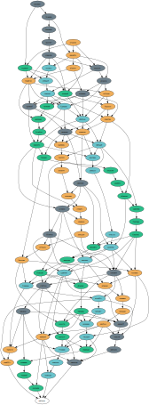

soterd
====

 

soterd is a full soter node implementation written in Go (golang). It started as a fork of the [btcd](https://github.com/btcsuite/btcd) project, where development focus has changed from providing a bitcoin node to providing an [implementation of blockdag](docs/intro_to_blockdag.md) for soter.

The intent of this project is for it to act as a component in Soteria's Trade Anything Platform (TAP); a pillar of Soteria's [Self Sustainable Decentralized Economy](https://www.ssde.io/) vision (SSDE).

This project is currently under active development and is in an [Alpha](https://en.wikipedia.org/wiki/Software_release_life_cycle#Alpha) state. It can be considered unstable and has not been in production use as of April 2019.

## For beginners in blockdag/blockchain technology

The [Intro to Soter BlockDAG](docs/intro_to_blockdag.md) document describes what blockdag is, and how soter/blockdag is different from bitcoin/blockchain.

## For software developers

The [Developers Intro](docs/developers_intro.md) document describes the capabilities of soterd, installation and updates, and links to the developer resources. 

## Testnet Status

The current Testnet (testnet1) will get frequent update in terms of code and genesis block. (could be as frequent as multiple times a day) So if you are running a full node for testnet1, please keep this in mind :-).

## Documentation

Project documentation is located in the [docs](docs/README.md) folder.

## Issue Tracker

The [integrated github issue tracker](https://github.com/soteria-dag/soterd/issues) is used for this project. 

## Other soteria projects

* [soterwallet](https://github.com/soteria-dag/soterwallet) - for making or receiving payments with soterd and the soter network. See the [Wallet](docs/README.md#Wallet) section for a note about its current functionality.
* [soterdash](https://github.com/soteria-dag/soterdash) - a web ui that provides information about the soter network.

## License

soterd is licensed under the [copyfree](http://copyfree.org) ISC License.
