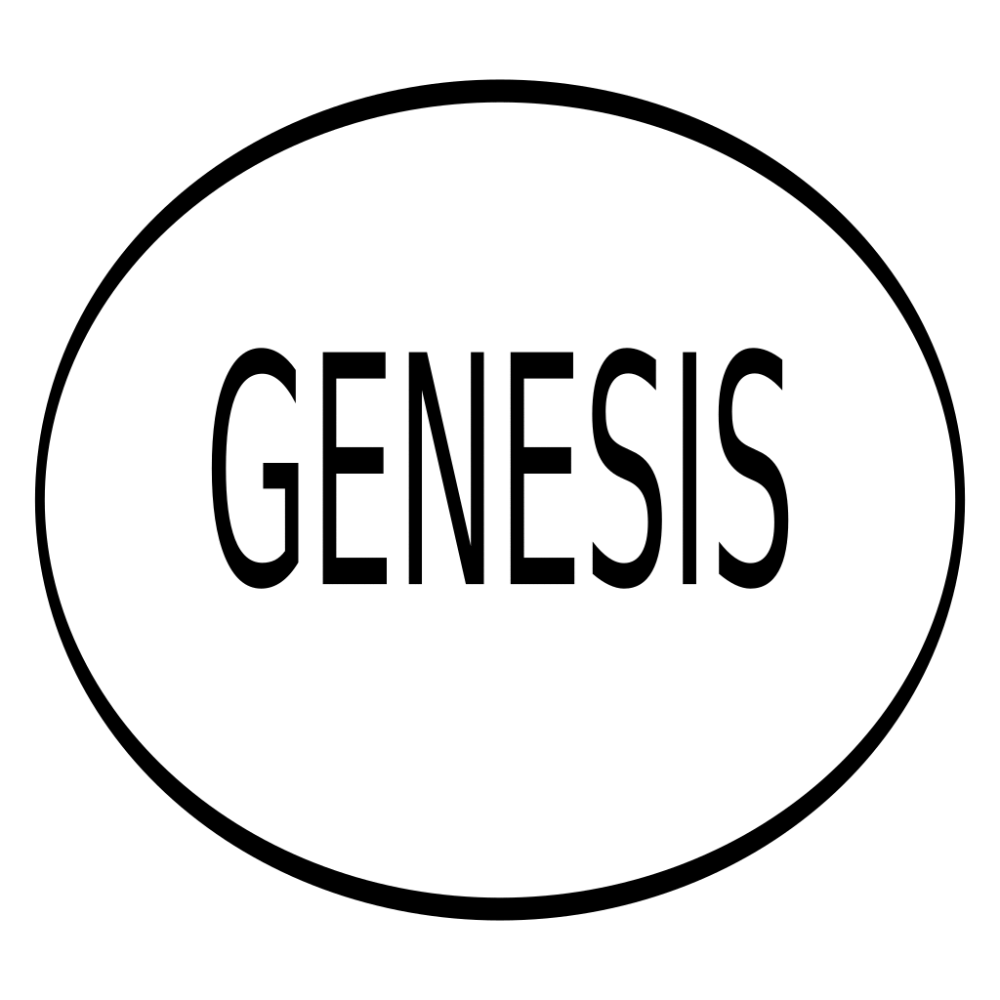

phantom
===

## Overview

Package `phantom` implements the [PHANTOM](https://eprint.iacr.org/2018/104) and [Greedy PHANTOM](https://github.com/AvivYaish/PHANTOM/blob/master/PHANTOM___an_efficient_implementation.pdf) protocols for blockdag ordering and coloring.

|Protocol|Files|
|----|----|
|PHANTOM|`graph.go`, `coloring.go`|
|Greedy PHANTOM|`greedygraphmem.go`|

In soterd, the blocks are connected to each other in a [directed acyclic graph](https://en.wikipedia.org/wiki/Directed_acyclic_graph) (BlockDAG), not a chain. This means that a block may have multiple parent blocks, and they may be at different heights. Using a blockdag allows for mining to be more inclusive, and increases transaction throughput in comparison to a blockchain. All blocks are attached to the BlockDAG, so it's important to be able to differentiate between blocks that contain legitimate transactions and blocks that don't. This is where PHANTOM comes in. 

PHANTOM is a protocol authored by Yonatan Sompolinsky and Aviv Zohar, which can help color and sort a dag. The coloring allows us to order nodes in terms of well-connected to the bulk of the graph, to less-connected. For a BlockDAG, a block's legitimacy is associated with its connectedness, so by ordering well-connected blocks before less-connected blocks, and treating the first matching transaction from genesis block as the valid one, we can guard against fraudulant transactions/double spending attempts published to the network by bad actors.

Greedy PHANTOM is a newer protocol authored by Aviv Yaish, which attempts to improve the efficiency of PHANTOM.

By combining the use of a BlockDAG with a coloring/sorting protocol, we can improve transaction throughput vs a blockchain by allowing more blocks to be accepted, while guarding against fraudulent transactions.

## How PHANTOM works

1. Determine a set of well-connected nodes in the dag.
    - Use the node's past _and_ future to determine how well-connected the block is.
2. Traverse through dag, following parent/child relationships. The well-connected (blue) set is used to determine what order the nodes will be in. Nodes not in the blue-set (red nodes) will be ordered later.
3. Produce an ordering for the dag.

## How Greedy PHANTOM works

Greedy PHANTOM is the same concept as PHANTOM, with some modifications to make it more efficient.

* Coloring is inherited from a node's 'bluest' (most well-connected) parent (hence the "Greedy"). This is called the _coloring parent_.
* The bluest tip of the graph is called the _coloring tip_.
* Coloring and sorting is incremental, in that only changes not processed by the node's coloring parent are processed when a node is added to the dag.
    * This uses a _coloring chain_, a set of blocks following coloring parents.
    
Here is a gif demonstrating the coloring of a dag with greedy phantom:

In this image:

* Green node: The coloring tip of the graph
* Blue nodes: Nodes in the blue set, from the perspective of the new node. (nodes that are well-connected to the bulk of the graph)
* Red nodes: Nodes outside of the blue set, from the perspective of the new node. (nodes that are less-connected to the bulk of the graph)
* Dotted-line nodes: The colouring chain of the graph. (a set of bluest nodes spanning from the colouring tip to genesis)

Note how some nodes flip back and forth between blue and red; How well-connected they appear to be from new tips can change as the graph grows. As more blocks are generated the coloring of the graph from the perspective of the tips should stabilize, and the sort order/coloring can be considered more authoritative. For transactions, having a grace period matching this stabilization time would help avoid bad actors from executing timing attacks against the BlockDAG.  

## PHANTOM vs Greedy PHANTOM

### Pros of PHANTOM

* Its implementation is easier to work with than Greedy PHANTOM.

### Cons of PHANTOM

* Time spent coloring/sorting is an issue, because the future of each node is evaluated, and the future of a node will grow indefinitely.

In order to use caching to limit the coloring/sorting time, boundaries have to be defined for:
* How many generations below the tips will we allow new nodes to connect to old ones? (70? 200? any past node?)
    * Once this is defined, the past sort-order can be below that threshold can be made permanent. Then we can restrict the evaluation of the dag to nodes above the threshold.
* How many generations into the future from a node, would be used for determining if it's in the blue-set.
    * Limiting how far into a node's future we look may influencing the coloring/sorting results, so this is not ideal.

### Pros of Greedy PHANTOM

* By **not** looking at a node's future, time spent coloring/sorting of nodes scales better than PHANTOM as the dag grows in size.

### Cons of Greedy PHANTOM

* The coloring/sorting implementation is more complicated than PHANTOM. It may be harder to understand coloring/sorting flow, to maintain without introducing issues.

### Other comparisons

* Our implementation of PHANTOM determines coloring/sorting on-demand (not when nodes are added to the dag). Greedy PHANTOM determines coloring/sorting as nodes are added to the dag, so there's more up-front computation.

## Why we choose Greedy PHANTOM

Greedy PHANTOM looks like it has potential for performing better than PHANTOM as the dag grows.
