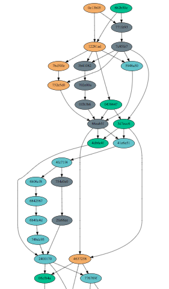
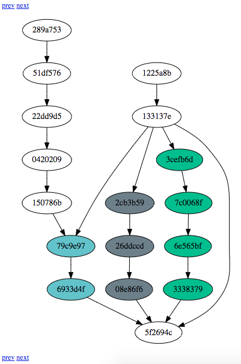
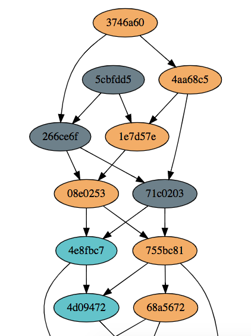

dagviz
===

[](http://copyfree.org)

## Overview 
The `dagviz` command spins up a number of soterd nodes, and has them generate and exchange blocks. It then generates a series snapshots of the dag at a configurable interval and renders them as a group html file as shown below: 



## Command Line Options
```
$ dagviz -h
Usage of dagviz:
  -blocktime int
    	Changing Mining Block Time in milliseconds
  -duration int
    	Duration of the Run in seconds (default 20)
  -interval int
    	Interval in milliseconds between each step (default 100)
  -l	Keep logs from soterd nodes
  -nodes int
    	Number of Nodes (default 4)
  -output string
    	Where to save the rendered dag
  -rankdir string
      Orientation of the graph: TB, BT, LR, RL (default TB) 
  -stepping
    	Generating Stepping Results
  -timespan int
    	Changing Mining Time Span in seconds
```

## Sample Runs

### No Stepping with default parameters
```
$ dagviz
Generating dag with 4 nodes for 20 seconds
Node Profile: block time 0 msec, time span 0 sec
Finalizing
Rendering Step 0
Saved dag to /var/folders/x4/_qwzxtrx6dxg_5y9px_r3dj00000gn/T/dagviz754224431/dag_0.html
```
Use web browser to open the location indicated in the result above or on Mac OSX, do 
```
$ open /var/folders/x4/_qwzxtrx6dxg_5y9px_r3dj00000gn/T/dagviz754224431/dag_0.html
```
The following DAG graph will be shown 

Sample 1



Sample 2



### Stepping with customized parameters 
```
$ dagviz -stepping -interval 1000
Generating dag with 4 nodes for 20 seconds
Node Profile: block time 0 msec, time span 0 sec
Taking snapshots for 20 seconds with 1000 msec interval
Generating Step 0
Generating for 25.20568ms
Generating Step 1
Generating for 1.138243809s
......
Generating Step 13
Generating for 16.001910625s
Generating Step 14
Generating for 17.255362911s
Generating Step 15
Generating for 18.795045323s
Generating Step 16
Generating for 20.320941358s
Finalizing
Rendering Step 0
Rendering Step 1
......
Rendering Step 13
Rendering Step 14
Rendering Step 15
Rendering Step 16
Saved dag to /var/folders/x4/_qwzxtrx6dxg_5y9px_r3dj00000gn/T/dagviz246286339/dag_0.html
```
Use web browser to open the location indicated in the result above or on Mac OSX, do 
```
$ open /var/folders/x4/_qwzxtrx6dxg_5y9px_r3dj00000gn/T/dagviz246286339/dag_0.html
```
The following DAG graph page will be shown and you can forward and backward between different steps. 

Sample 3


