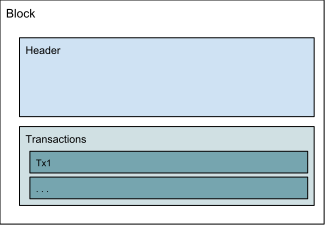
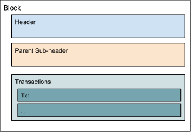
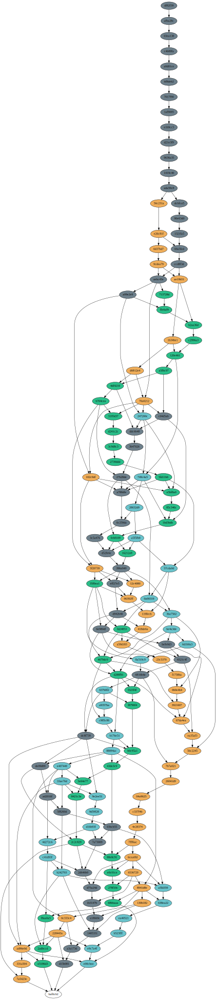

Intro to Soter BlockDAG
===

This document describes what BlockDAG is, and how it differs from blockchain and bitcoin. BlockDAG builds on the concept of blockchain, so we'll start with a description of blockchain.

For a description of terms you'll find in this project, please refer to the [Glossary of Terms](glossary_of_terms.md) document.

## Blockchain summary

Blockchain is a list of blocks that are cryptographically linked to one another, and exchanged through a peer-to-peer network. The blocks contain data, usually in the form of transactions. Cryptographic signatures can be used to indicate ownership of things in transactions, and the distribution of blocks across a p2p network allows the system to scale and act as a decentralized database. 

## Bitcoin summary

Bitcoin is a digital currency that implements a blockchain, to provide:
* Decentralization; You can transfer currency to others without an intermediary.
* Some level of anonymity; The currency isn't directly tied to your real-world identity.
* Trustless consensus; The rules of the blockchain implementation allow you to have a level of trust in the block validation efforts done by strangers, and make it difficult to alter blocks and transactions. 

In bitcoin, a block, as shown in Figure 1, consists of:
* Block header
* Transactions

  
Figure 1: Block Stucture in Bitcoin 

Refer to the [bitcoin developer reference](https://bitcoin.org/en/developer-reference#block-chain) for more information about a bitcoin block, header, or transactions.

## BlockDAG summary

BlockDAG provides the main features of the bitcoin design, as well as:
* Improved transaction throughput; More transactions per second can be handled in a soter/blockdag network than a bitcoin/blockchain network.
* Allowing the use of a proof-of-work system that improves the accessibility and fairness of block mining.

A soter block is similar to a bitcoin block, but contains a extra parent sub-header, as shown in Figure 2:

  
  Figure 2: Block Structure in BlackDAG 

The parent sub-header consists of:
* Version - A value that could be used to trigger different block evaluation rules
* Parents count - The number of parents this block has
* Parents - A list of parents

Each parent consists of:
* Hash - The hash of the parent block
* Data - Up to 32 bytes of metadata. (Currently unused)

With blocks that can be connected to multiple parents, instead of a chain of blocks, the blockdag structure is shown in Figure 3 as below:

  
  Figure 3: An Example of BlockDAG  

In the above example, each circle represents a block. Blocks were generated by 4 soterd nodes, and are color-coded to the node that created it. Arrows point from each block to its parents.

The tip of the blockdag is at the top of the image, and the genesis block is uncolored at the bottom. You can also tell the genesis block (a hard-coded block that acts as the starting point of the dag) by its lack of coloring and parents.

You can use the [dagviz](../cmd/dagviz/README.md) command to generate your own example blockdag.

#### BlockDAG ordering

soterd uses an [implementation](../blockdag/phantom/README.md) of the [PHANTOM protocol](https://eprint.iacr.org/2018/104) to determine block ordering.

## Next steps

1. Follow the [installation guide](install_run_update.md) for setting up and running soterd.

2. Refer to the [main README file](../README.md) for more information. 
