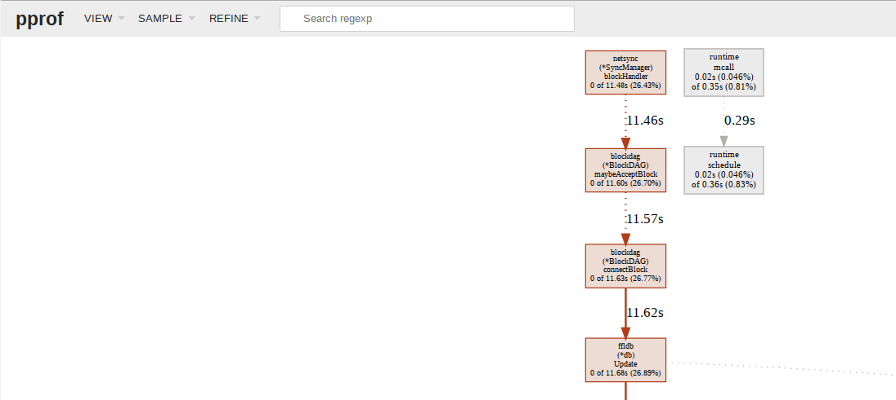
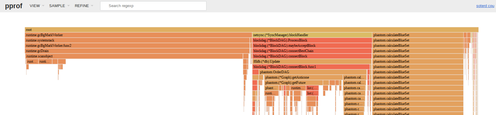

Soterd profiling
===

Soterd makes use of the golang [net/http/pprof](https://golang.org/pkg/net/http/pprof/) package, to provide remote profiling capabilities. It can be enabled with the `–-profile=<tcp port>` cli parameter. If we connect to the pprof instance on a soterd node, we can take sample measurements from the program and tell how long different function calls are taking. This document describes how to set up profiling of a soterd node.

## Prerequisites

Flame graphs are only available in **go 1.11 or newer**, so make sure you are using a high-enough golang version.


## Profiling a soterd node as its mining

Here we'll be setting up two soterd nodes, and running profiling on one of them. In this case, profiling is set up in a client-server arrangement. A pprof server runs on the soterd node, and we'll connect to it with a pprof client in order to ask the server to take measurements. Our pprof client will provide an HTML rendering of the results of the measurements.

1. Start a soterd node, with pprof web-ui enabled (we'll choose tcp port 19000 in our example)

    ````
    soterd --simnet --datadir=/tmp/soterd_node_a/data --logdir=/tmp/soterd_node_a/logs --listen=127.0.0.1:18555 --rpclisten=127.0.0.1:18556 --rpcuser=USER --rpcpass=PASS --connect=127.0.0.1:20555 --miningaddr=SXXJVcFu1n6jpv2jHZTFCD3XfR6AbGH9Ae --debuglevel=debug --profile=19000
    ````
    
2. Start another soterd node, so that we can mine and sync blocks

    ```
    soterd --simnet --datadir=/tmp/soterd_node_b/data --logdir=/tmp/soterd_node_b/logs --listen=127.0.0.1:20555 --rpclisten=127.0.0.1:20556 --rpcuser=USER --rpcpass=PASS --connect=127.0.0.1:18555 --debuglevel=debug
    ```
    
3. Connect golang's pprof tool to the pprof instance on the first soterd node

    ```
    go tool pprof -http=:19001 http://localhost:19000/debug/pprof/profile?seconds=30
    ```
    
    * The pprof client will make its rendering available on an http server listening on tcp port `19001`
    * The rendering will be available after the samples are finished being collected in 30 seconds.
    
4. Tell the first node to generate 500 blocks, so that we can measure the CPU time of function calls made during block-generation and synchronization

    ```
    soterctl --simnet --rpcuser=USER --rpcpass=PASS --rpcserver=127.0.0.1:18556 --skipverify generate 500
    ```
    
After the 30 seconds of profiling finishes, a new browser window should open with the pprof client's rendered results. It may look like this:



From this page, click on `View → Flame Graph` to see how much time each call is spending. You can click on a call to drill-down further. It may look like this:




### Notes about using loopback addresses

The self-signed cert that `soterd` generates by default is only valid for `127.0.0.1`.

If you use other loopback addresses (like `127.0.0.29`), the cert won't be valid for them, and you may need to use `--skipverify` cli flag when connecting to those.

Alternatively, you can specify the path to the cert chain `soterd` generated/used, with the `--rpccert` cli flag. `soterd` uses the `~/.btcd/rpc.cert` path by default on non-windows systems.

#### loopback on macOS

* Note that Mac only accepts localhost `127.0.0.1` [by default](https://til.hashrocket.com/posts/94a6225fad-loopback-to-different-127-ips-mac-osx). Use 
```
sudo ifconfig lo0 alias 127.0.0.<n> up
```
To add an alias for another address
